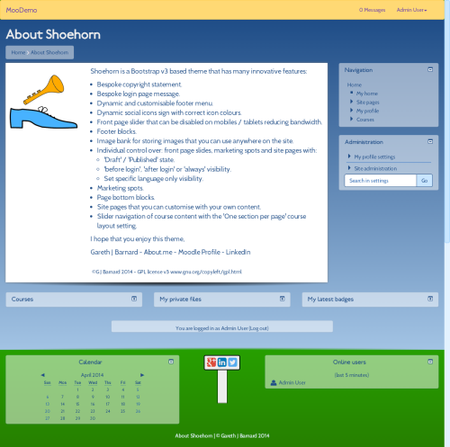

Introduction
============
Shoehorn theme.



About
=====

 * copyright  &copy; 2014-onwards G J Barnard in respect to modifications of the Bootstrap theme for Moodle.
 * author     G J Barnard - http://about.me/gjbarnard and http://moodle.org/user/profile.php?id=442195
 * author     Based on code originally written by Bas Brands, David Scotson and many other contributors.
 * license    http://www.gnu.org/copyleft/gpl.html GNU GPL v3 or later

Free Software
=============
The Shoehorn theme is 'free' software under the terms of the GNU GPLv3 License, please see 'COPYING.txt'.

It can be obtained for free from:
https://moodle.org/plugins/view.php?plugin=theme_shoehorn
and
https://github.com/gjb2048/moodle-theme_shoehorn/releases

You have all the rights granted to you by the GPLv3 license.  If you are unsure about anything, then the
FAQ - http://www.gnu.org/licenses/gpl-faq.html - is a good place to look.

If you reuse any of the code then I kindly ask that you make reference to the theme.

If you make improvements or bug fixes then I would appreciate if you would send them back to me by forking from
https://github.com/gjb2048/moodle-theme_shoehorn and doing a 'Pull Request' so that the rest of the
Moodle community benefits.

Donations
=========
This theme is provided to you for free, and if you want to express your gratitude for using this theme, please consider donating by:

PayPal - Please contact me via my 'Moodle profile' (above) for details as I am an individual and therefore am unable to have 'donation' / 'buy me now' buttons under their terms.

Flattr - https://flattr.com/profile/gjb2048

Donations may allow me to provide you with more or better features in less time.

Customisation
=============
If you like this theme and would like me to customise it, transpose functionality to another theme or build a new theme
from scratch, then I offer competitive rates.  Please contact me via www.gjbarnard.co.uk/contact/ or gjbarnard at gmail dot com
to discuss your requirements.

Required version of Moodle
==========================
This version works with Moodle version 2014111000.00 release 2.8 (Build: 20141110) and above within the 2.8 branch until the
next release.

Please ensure that your hardware and software complies with 'Requirements' in 'Installing Moodle' on
'docs.moodle.org/28/en/Installing_Moodle'.

Required version of Bootstrap 3
===============================
You will need to get and install the parent Bootstrap theme from:

https://moodle.org/plugins/view.php?plugin=theme_bootstrap - Currently release 2014120803.
or
https://github.com/gjb2048/theme_bootstrap

in order to install and use Shoehorn.

I would like to thank Bas Brands and David Scotson for their work on the theme.  With a special mention to: Stuart Lamour,
Mark Aberdour, Paul Hibbitts and Joby Harding.

Licenses used
=============
GPLv3 - http://www.gnu.org/licenses/license-list.html#GNUGPL
-----
Shoehorn theme code and icons (including altered core icons) - https://moodle.org/mod/forum/discuss.php?d=135896, 
http://www.gnu.org/licenses/gpl-faq.html#GPLPluginsInNF and http://www.gnu.org/licenses/license-list.html#OtherLicenses

LGPLv3 - http://www.gnu.org/licenses/license-list.html#LGPL
------
Syntax Highlighter - http://alexgorbatchev.com/SyntaxHighlighter/download/

MIT - http://www.gnu.org/licenses/license-list.html#Expat
---
FontAwesome LESS - http://fontawesome.io/license/
backstretch.js - http://srobbin.com/jquery-plugins/backstretch/
Bootstrap - http://getbootstrap.com
Syntax Highlighter - http://alexgorbatchev.com/SyntaxHighlighter/download/

WTFPL - http://www.gnu.org/licenses/license-list.html#WTFPL - http://sam.zoy.org/wtfpl/
-----
fitvids.js - Chris Coyier - http://css-tricks.com + Dave Rupert - http://daverupert.com and credit to Thierry Koblentz
- http://www.alistapart.com/articles/creating-intrinsic-ratios-for-video/.

SIL - http://www.gnu.org/licenses/license-list.html#SILOFL
---
Fonts:
Cabin - http://www.fontsquirrel.com/fonts/cabin
Railway - http://www.fontsquirrel.com/fonts/railway
FontAwesome - http://fontawesome.io/license/

Installation
============
 1. Ensure you have the version of Moodle as stated above in 'Required version of Moodle'.  This is essential as the
    theme relies on underlying core code that is out of my control.
 2. Login as an administrator and put Moodle in 'Maintenance Mode' so that there are no users using it bar you as the administrator.
 3. Copy the extracted 'shoehorn' folder to the '/theme/' folder.
 4. Go to 'Site administration' -> 'Notifications' and follow standard the 'plugin' update notification.
 5. Select as the theme for the site.
 6. Put Moodle out of Maintenance Mode.

Note: If you get no CSS whatsoever, then please add the following to your Apache web server httpd.conf file after loading the modules
and restart (without the ` if you see them):

```
<IfModule mpm_winnt_module>
   ThreadStackSize 8388608
</IfModule>
```

Ref: https://github.com/bmbrands/theme_bootstrap/issues/342#issuecomment-58152495 and https://code.google.com/p/minify/issues/detail?id=62.

Upgrading
=========
 1. Ensure you have the version of Moodle as stated above in 'Required version of Moodle'.  This is essential as the
    theme relies on underlying core code that is out of my control.
 2. Login as an administrator and put Moodle in 'Maintenance Mode' so that there are no users using it bar you as the administrator.
 3. Make a backup of your old 'shoehorn' folder in '/theme/' and then delete the folder.
 4. Copy the replacement extracted 'shoehorn' folder to the '/theme/' folder.
 5. Go to 'Site administration' -> 'Notifications' and follow standard the 'plugin' update notification.
 6. If automatic 'Purge all caches' appears not to work by lack of display etc. then perform a manual 'Purge all caches'
   under 'Home -> Site administration -> Development -> Purge all caches'.
 7. Put Moodle out of Maintenance Mode.

Uninstallation
==============
 1. Put Moodle in 'Maintenance Mode' so that there are no users using it bar you as the administrator.
 2. Change the theme to another theme of your choice.
 3. In '/theme/' remove the folder 'shoehorn'.
 4. Put Moodle out of Maintenance Mode.

Videos and FitVids
==================
Shoehorn uses FitVids.js - http://fitvidsjs.com/ - to make embedded videos responsive.  If you do not want this feature for a particular
video, then please add the class 'fitvidsignore' to the video element.

Reporting issues
================
Before reporting an issue, please ensure that you are running the latest version for your release of Moodle.  It is essential
that you are operating the required version of Moodle as stated at the top - this is because the theme relies on core
functionality that is out of its control.

I operate a policy that I will fix all genuine issues for free.  Improvements are at my discretion.  I am happy to make bespoke
customisations / improvements for a negotiated fee. 

When reporting an issue you can post in the theme's forum on Moodle.org (currently 'moodle.org/mod/forum/view.php?id=46')
or check the issue list https://github.com/gjb2048/moodle-theme_shoehorn/issues and if the problem does not exist, create an
issue.

It is essential that you provide as much information as possible, the critical information being the contents of the theme's 
'version.php' file.  Other version information such as specific Moodle version, theme name and version also helps.  A screen shot
can be really useful in visualising the issue along with any files you consider to be relevant.

Known issues
============
1. RTL functionality is not quite ready.  In the 'General' settings there is an experimental switch 'dynamiclang' which is my first
   attempt at implementing an idea as described on: https://moodle.org/mod/forum/discuss.php?d=264955.  This idea has further been
   developed by me in the Essential theme: https://github.com/gjb2048/moodle-theme_essential/issues/249.  The main area of issue
   has been the quiz.  Once Essential 2.7.8 is released and any other issues resolved, I will take what I have learnt there and apply
   to Shoehorn.  Or it might be the case that the parent Bootstrap theme in https://github.com/bmbrands/theme_bootstrap/issues/262 will
   help to resolve this.

Todo
====
1. Consider moving fluid container setting from Bootstrap 3 settings.
2. Fix D&D moving blocks into the page-bottom region and moving around not having the right width / position.

Version information
===================
18th January 2015 - Version 2.8.1 - Stable.
  1. Tidied up slider such that it does not cause the content to jump on the frontpage and the images are centred.
  2. Added a 'Go to bottom of page' icon in the navbar to make it easier when on settings and course pages.
  3. Tidy up course slider for one page per section courses - always show arrows on mobiles and tablets.
  4. Always show arrows on mobiles and tablets for the front page slider.
  5. Added a 'Go to top of page' icon that shows when the page is scrolled down.
  6. Update to Bootstrap 3.3.1: https://github.com/twbs/bootstrap/releases/tag/v3.3.1.
  7. Fixed 'Exit activity' in a SCORM activity not appearing the same as the breadcrumb.
  8. Fixed blocks in footer not being wide enough.
  9. Fixed issue #406 from Essential: Assignment types: Online Audio Recording.
 10. Fixed issue #408 from Essential with regards to the background.
 11. Fixed issue with social icons with glyphicons.
 12. Rectified need to have separated M2.7 specific Bootstrap as parent theme.  Now can use:
     https://github.com/gjb2048/theme_bootstrap or https://moodle.org/plugins/view.php?plugin=theme_bootstrap
 13. Update grunt packages to latest versions.
 14. Added BCU theme 'This course' menu for courses.

14th November 2014 - Version 2.8.0.2 - Release candidate.
  1. Release candidate for Moodle 2.8.

12th November 2014 - Version 2.8.0.1.
  1. First version for Moodle 2.8.

10th November 2014 - Version 2.7.1.2
  1. Fixed bottom right hover border of last menu item of the compact navbar.
  2. Fixed 'Go' button on the right when administration block in page bottom region.
  3. Fixed float issue with section 0 in the Grid format and course tiles.

5th November 2014 - Version 2.7.1.1
  1. Fix #5 - Scorm report button issues.  Thanks to Kirk Chapman for reporting.
  2. Update readme license details.  Thanks to Antony Borrow.
  3. Tidy up site page images.
  4. Applied MDL-43824 grade.less to experimental CSS and raised https://github.com/bmbrands/theme_bootstrap/pull/347 for parent Bootstrap.
  5. Applied same Essential FitVids solution: https://github.com/gjb2048/moodle-theme_essential/issues/354.
  6. Site page improvements for when they cannot be displayed.
  7. Update to Bootstrap 3.3.0 - https://github.com/twbs/bootstrap/releases/tag/v3.3.0.
  8. Fixed #8 - Course tile description too low.

12th October 2014 - Version 2.7.1 - First stable release.
  1.  Tweaks to editing the quiz as a result of: https://github.com/gjb2048/moodle-theme_essential/issues/318.

4th October 2014 - Version 2.7.0.4 - DO NOT INSTALL ON PRODUCTION SERVERS.
  1.  With the release of a stable parent Bootstrap on: https://moodle.org/mod/forum/discuss.php?d=271448, I have decided to release
      this release candidate version of Shoehorn.
  2.  You will need the parent theme from: https://moodle.org/plugins/download.php/6987/theme_bootstrap_moodle27_2014100300.zip.

27th August 2014 - Version 2.7.0.3 - DO NOT INSTALL ON PRODUCTION SERVERS.
  1.  Added look and feel settings to control background image and content transparency for the content area
      for all pages and the front page as an individual separate.
  2.  Various transparency changes to navbar, menu and footer.
  3.  Fixed the slider minimum height at varying device widths as so to prevent transition jitter in the content area.
  4.  Added IE detection with request to upgrade.
  5.  Use Bootstrap JS way of data-toggle for course summary on front page, see: https://github.com/bmbrands/theme_bootstrap/issues/301.
  6.  Fixed two column login page when 'auth_instructions' setting is set.
  7.  Fixed all pages image showing on front page when it has none.
  8.  Placed a panel around the page heading when an image is shown and change the text to the text colour.
  9.  Added option to compact the navigation bar.
 10.  Added option to fix the navigation bar at the top of the page.
 11.  Added experimental dynamic language option to test: https://moodle.org/mod/forum/discuss.php?d=264955.
 12.  Updated to FontAwesome 4.2.0.
 13.  Fix user svg images for IE11.

11th July 2014 - Version 2.7.0.2 - DO NOT INSTALL ON PRODUCTION SERVERS.
  1.  Added syntax highlighting to courses - http://alexgorbatchev.com/SyntaxHighlighter/.
  2.  Tweaks to question styling, specifically multiple choice.
  3.  Fixed front page and single page course slider with glyphicons.
  4.  Tweaks to course styling when editing.
  5.  Made slider previous and next icons only appear when slider hovered over.
  6.  Added custom Collapsed Topics icons.
  7.  Fixed issue with course tiles and front page blocks in editing mode.
  8.  Updated Gruntfile.js and package.json.
  9.  Fixed docking issues as reported on https://moodle.org/mod/forum/discuss.php?d=263080#p1139975.
 10.  Fixed fake block issue: https://github.com/gjb2048/moodle-theme_shoehorn/issues/1 and quiz number
      navigation hovering / borders.
 11.  Made slider image max sizes responsive.
 12.  Added 'Home' link to footer menu.  Thanks to Natalie Denmeade for reminding me about this.

17th June 2014 - Version 2.7.0.1 - DO NOT INSTALL ON PRODUCTION SERVERS.
  1.  Update development to Moodle 2.7.
  2.  Switch to using YUI version of Bootstrap theme: https://github.com/bmbrands/theme_bootstrap as master has changed.
      jQuery version is now: https://github.com/bmbrands/theme_bootstrap/tree/bootstrap3_dev and base theme is:
      https://github.com/bmbrands/theme_bootstrap/tree/bootstrap3_basetheme
  3.  Improved svg colour change in Gruntfile.js for plugins too.
  4.  Converted user icons to svg.
  5.  Added docking.
  6.  Added docking setting.
  7.  Added optional 'My courses' menu.
  8.  Fixed grade report: https://moodle.org/mod/forum/discuss.php?d=261626.
  9.  Added in and adapted 'mycourses' layout from the Elegance theme.
 10.  Added in and adapted 'course tiles' from the Elegance theme.
 11.  Added optional 'Backstretch' (https://github.com/srobbin/jquery-backstretch) for the login page.
 12.  Added optional side block region accordion functionality.  Note: This disables docking for side regions.
 13.  Added FitVids to scale media - http://fitvidsjs.com/
 14.  Added credits to this readme.
 15.  Updated to FontAwesome 4.1.
 16.  Removed old Glyphicon font setting and introduced a FontAwesome setting that works across the theme.  Note:
      I have decided to not introduce the icon replacement code that is in other themes for this as it is not yet
      consistent with being able to replace everything due to the fixed icons in the JavaScript.
 17.  Borrowed and adapted the FontAwesome icon styles for components from the Elegance theme as found in elegance.css.
 18.  Made the social icon signpost optional.
 19.  Added dynamic course icons on the course menu based on course id.

5th May 2014 - Version 2.6.0.3 - DO NOT INSTALL ON PRODUCTION SERVERS.
  1.  Fixed no navbar on the login page.
  2.  Fixed enrolment button not showing background colour.
  3.  Fixed search box and icon at the top of forums.
  4.  Fixed hover over messages in message drop-down.
  5.  Fixed user profile picture on view profile page of course participants.
  6.  Fixed pop-up user message.
  7.  Fixed bottom colour needing to be the footer colour and the body background the top of page for the 'navbar' by applying the
      bottom footer colour to the 'html' tag.
  8.  Fixed validator links to be inline in page info section with dividers.
  9.  Added favicon.
 10.  Separated out course format renderers and updated for bootstrap fix https://github.com/bmbrands/theme_bootstrap/pull/250.
 11.  Created 'imagebank.php' to serve image bank images so that theme designer mode off can be used and therefore
      using 'purge all caches' will not affect the url.  Need to think of perhaps shortening the process by somehow using
      '$theme->setting_file_serve' in 'theme_shoehorn_pluginfile' of lib.php, but current process has safeguards.  However,
      this is implementation-al and should not affect 'imagebank.php' URLs.
 12.  Collapsed Topics inspired CONTRIB-4099 to look again at the course layout and fix.
 13.  Bootstrap parent: https://github.com/gjb2048/theme_bootstrap/releases/tag/V2014032100_2
 14.  Implemented show old messages setting I developed on: https://github.com/gjb2048/theme_bootstrap/commit/86ca17108e5f03daf9697899188dffc7f8e5b7f2

 2nd April 2014 - Version 2.6.0.2 - DO NOT INSTALL ON PRODUCTION SERVERS.
  1.  Bootstrap parent: https://github.com/gjb2048/theme_bootstrap/releases/tag/V2014032100
  2.  Beta development version.

 8th March 2014 - Version 2.6.0.1 - DO NOT INSTALL ON PRODUCTION SERVERS.
  1.  Alpha development version.
  2.  Dynamic social icon colour footer sign.
  3.  Dynamic customisable footer menu.

Thanks
======
My thanks go to all the creators and participants of the Bootstrap theme:
Bas Brands, David Scotson and many other contributors.

Credits
=======

Bootstrap
------------
Authors: Mark Otto and Jacob Thornton
URL: http://getbootstrap.com/
License: https://github.com/twbs/bootstrap/blob/master/LICENSE

Bootstrap 3 for Moodle conversion
------------
Authors: Bas Brands and David Scotson
URL: https://github.com/bmbrands/theme_bootstrap
License: MIT/GPL2 Licensed

Course tiles idea and initial coding
------------
Author: Jason La Greca
URL: http://beenlearning.com/
License: MIT/GPL2 Licensed

Backstretch.js
------------
Author: Scott Robbin
URL: http://srobbin.com/jquery-plugins/backstretch/
License: https://raw.githubusercontent.com/srobbin/jquery-backstretch/master/LICENSE-MIT

FitVid.js
------------
Authors: Chris Coyier and Paravel
URL: http://fitvidsjs.com/
License: None

Me
==
G J Barnard MSc. BSc(Hons)(Sndw). MBCS. CEng. CITP. PGCE.
Moodle profile: http://moodle.org/user/profile.php?id=442195
Web profile   : http://about.me/gjbarnard
